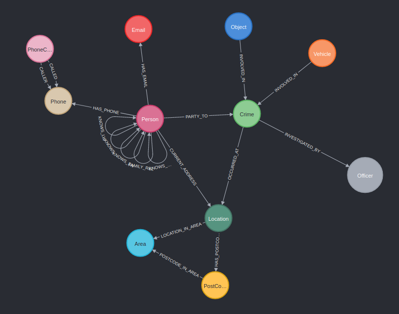

# Finding rogue MI6 agents !

## Plot

You are an MI6 analyst based in London. Some agents have been under investigation for fraud and collusion in the government. The MI6 wants to make sure there is no officers having had any suspicious contact with persons involved in crimes while they were under investigation by that same officer. Time limit to solve: none.

## Graph schema

## Objective

Given the dataset at your disposal, find (if any!) officers that have had suspicious relationships with persons involved in crimes that this Officer is investigating.

More precisely, an officer is suspicious if … 
He has a family relationship (FAMILY_REL), phone calls (CALLER or CALLEE), or knows (KNOWS) any person involved in a crime(PARTY_TO) that he/she is himself/herself investigating (INVESTIGATED_BY)

## My analysis

You can connect to API on the following link : https://murmuring-hollows-41110.herokuapp.com/

First of all, the first thing that challenges me in the diagram is the unique relationship of the "officer" node. This node is connected to the "crime" node, so I deduce that there can be no relationship between an officer and a person other than a crime. 

But let's imagine what the investigation could have yielded in such a case. The idea in this first request is to verify that there is no suspicious relationship between an officer and a person related to the same crime. We will therefore verify that they do not know each other, that they have never called each other and that they are not related. 

The result can be seen at the following endpoint and logically does not give any conclusive result. 
### https://murmuring-hollows-41110.herokuapp.com/investigation-result
